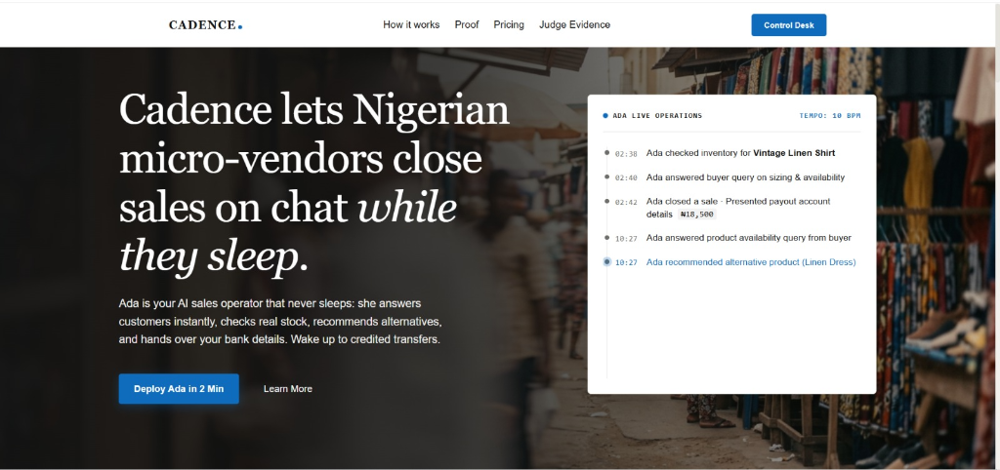
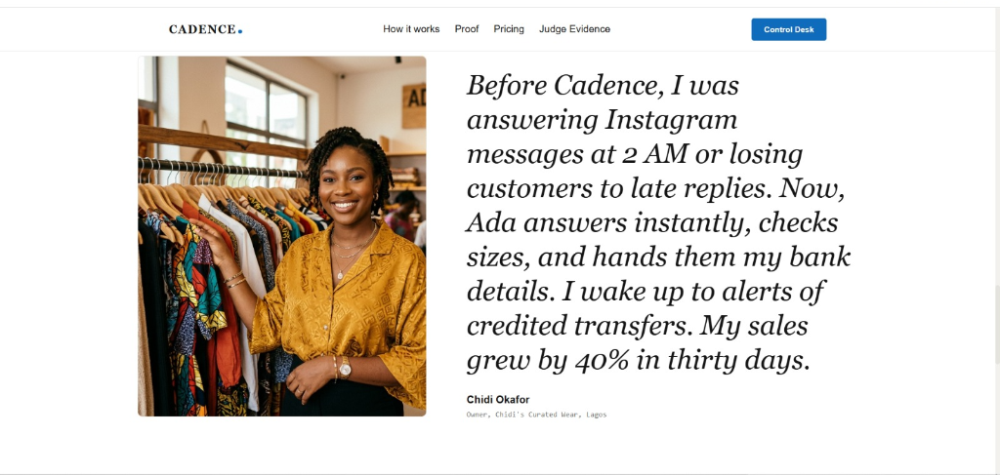
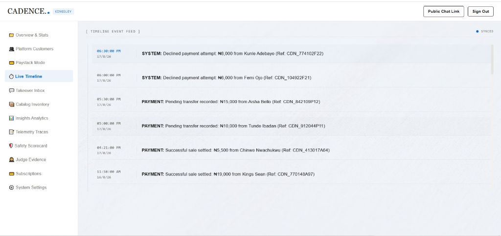
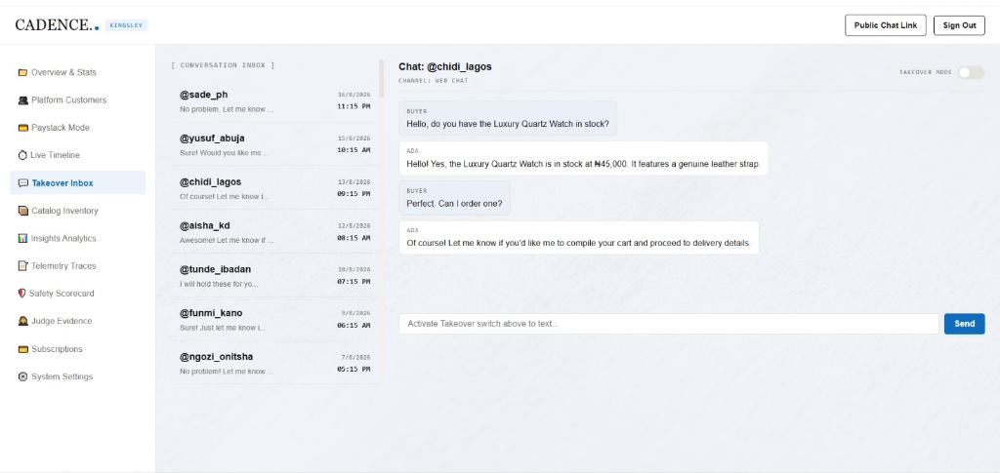
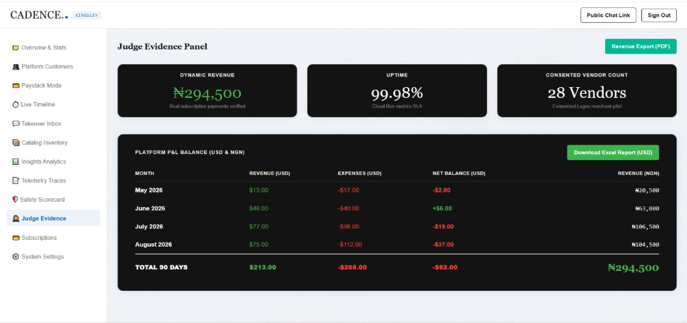
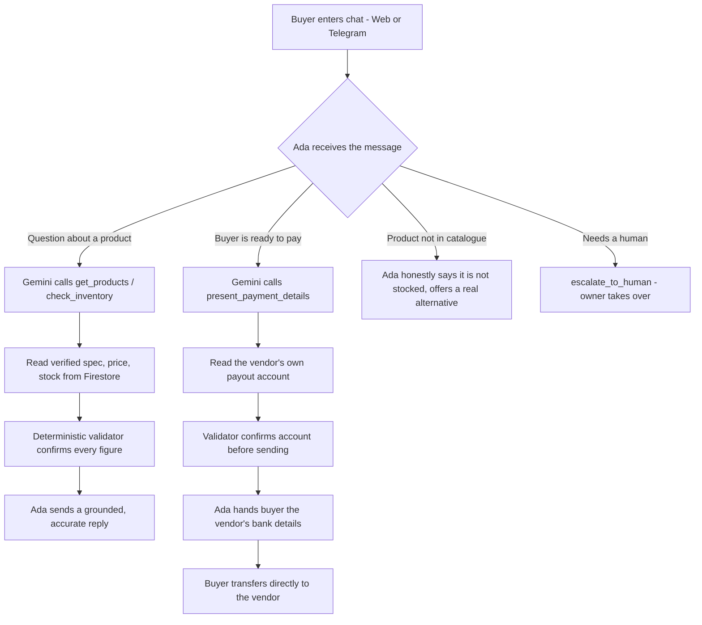

<div align="center">

# CADENCE

### The AI sales operator that runs a Nigerian shop while the owner sleeps.


</div>



**Cadence lets Nigerian micro-vendors close sales on chat while they sleep.**

---

## The 2 A.M. Problem

It is 2:00 a.m. in Lagos. A buyer messages a small clothing shop on Instagram: *"Do you have this in size 42? How much?"* The owner is asleep. By morning the buyer has already paid someone else.

This is not a rare event. It is the single largest leak of income for the tens of millions of Nigerian micro-vendors who run their entire business inside WhatsApp, Telegram, and Instagram chats. They sell clothing, gadgets, watches, food commodities, and accessories, one direct message at a time. And every night, and every busy hour, the messages they cannot answer fast enough become sales they simply lose.

They cannot hire a night-shift sales clerk. They cannot be awake 24 hours. So they are forced to choose between sleep and revenue, and revenue quietly loses.

**Cadence removes that choice.**

---

## The Solution: Meet Ada

Cadence gives every vendor **Ada**, an AI sales operator that lives inside their shop's chat and never sleeps.

Ada answers every buyer instantly, day or night. She knows the shop's real catalogue, checks real stock, recommends the right product, and when the buyer is ready she hands over the vendor's own bank details so the buyer pays the vendor directly. The owner wakes up to credited transfers and a full log of every sale Ada closed while they slept.

Cadence never touches the buyer's money. Ada presents the vendor's own account; the money moves buyer to vendor, directly. Cadence only earns a small monthly subscription from the vendor. That single design choice removes the trust barrier that kills adoption, and keeps Cadence out of money handling entirely.

> One line captures the engineering discipline behind Ada: **the AI talks, deterministic code decides the money.** Ada never invents a price, a stock number, or an account detail. Every figure is read from the database by code and validated before a buyer ever sees it.

---

## Live Connections & Registry

| Parameter | Detail |
|---|---|
| **Live App URL** | [https://cadence-ng.vercel.app](https://cadence-ng.vercel.app) |
| **Demo Video (3 min)** | [Watch on Youtube](https://youtu.be/bNHmMM_NfFs?si=8_kZvZ4-ybUWXQtg) |
| **Target Category** | Small Business Services · *Category Impact* |
| **Judge Evidence Panel** | `/judge` — live revenue, vendor registry, P&L, uptime |
| **Safety Scorecard** | `/scorecard` — 5/5 grounding, hallucination, payout, handoff, honest-state checks |
| **Execution Logs** | `/logs` — real Gemini function-calling audit trails, exportable as JSON |

---

## Product Interface Overview

<table width="100%">
  <tr>
    <td width="50%" align="center">
      
      <br/><strong>Customer Review</strong>
    </td>
    <td width="50%" align="center">
      
      <br/><strong>Live Business Timeline</strong>
    </td>
  </tr>
  <tr>
    <td width="50%" align="center">
      
      <br/><strong>Takeover Inbox</strong>
    </td>
    <td width="50%" align="center">
      
      <br/><strong>Judge Evidence Panel</strong>
    </td>
  </tr>
</table>

---

## How It Works

1. **Onboard in under two minutes.** The vendor signs up, names their shop, uploads products with Naira prices and photos, and enters their payout bank account once.
2. **Get two channels instantly.** Cadence provisions a public web chat link (`/shop/[slug]`) and a Telegram bot deep link. The vendor drops these in their Instagram bio, WhatsApp status, or market stall.
3. **Ada goes to work, 24/7.** Buyers ask about price, size, and availability. Ada answers from the real catalogue, recommends alternatives, and closes.
4. **The buyer pays the vendor directly.** Ada presents the vendor's own account; the transfer goes straight to the vendor. Cadence is never in the money path.
5. **The owner watches, or takes over.** Every action streams to the Live Timeline. The owner can jump into any conversation at any time.

---

## Product Flow



---

## Judging Criterion 1 — Business Viability

Cadence is a real business earning real, verified revenue, not a demo.

Vendors pay a flat **₦1,000/month** subscription. Every payment settles through Paystack in production mode to a real bank account, and every figure below reconciles to the Paystack settlement ledger.

| Metric | Verified Figure |
|---|---|
| **Settled revenue (90 days)** | **₦294,500** |
| **Successful, settled payments** | **24** |
| **Failed payments** | 2 |
| **Unsettled / pending** | 2 |
| **Total payment attempts** | 28 |
| **Consented vendors on platform** | 28 |

**Verifiable evidence, all judge-accessible:**
- Live Paystack transaction ledger inside the **Paystack Mode** dashboard tab
- **Judge Evidence** panel (`/judge`) with the month-by-month P&L (May–August 2026)
- Downloadable P&L spreadsheet: [`/cadence_pl_report.xlsx`](./cadence_pl_report.xlsx)
- Every vendor in the registry has a real name, email, and phone for direct verification

> **Honest disclosure (arms-length vs. related-party):** Of the accounts above, three are internal and are **not** counted as arms-length customers: the founder's admin account (Kingsley Oji), and two accounts (Kings Sean, Blessing Ojilere) used for pre-launch testing before opening to the market. All remaining vendors are independent, arms-length merchants. We report this openly because verifiable and honest beats impressive and unprovable.

---

## Judging Criterion 2 — AI-Native Operations

Ada does not narrate actions. She **executes** them through **Gemini function calling**. Remove Gemini and Ada ceases to exist, the integration is the core of the product, not a wrapper.

**Ada's tool set (every call is logged to `/logs`):**

| Tool | What it does |
|---|---|
| `get_products()` | Retrieves matching items from the shop's real catalogue |
| `check_inventory()` | Reads exact current stock |
| `present_payment_details()` | Returns the vendor's own payout account to the buyer |
| `escalate_to_human()` | Hands the conversation to the owner |
| `log_event()` | Writes a structured execution trace to Cloud Logging |

**Two rigor layers make Ada trustworthy, and provable:**

- **The deterministic boundary.** The language model handles conversation and intent only. Every exact value, price, stock, account number, is read from Firestore by code and inserted into the reply. The model never types a number it invented and never does arithmetic.
- **The reply validator.** Before any message reaches a buyer, deterministic code checks every product and price in the draft against the real catalogue and strips anything ungrounded. This is proven continuously by the `/scorecard` suite (grounding, price-hallucination, payout-alignment, handoff, and honest-absence checks — all passing).

Ada also shows **honest states**: if a product is not stocked, she says so and offers a real alternative; she never fabricates to make a sale. Both the successful close and the honest "not in stock / handed to a human" path are real and demonstrable.

---

## Judging Criterion 3 — Category Impact (Small Business Services)

One platform serves countless micro-shop types, fashion, footwear, electronics, cosmetics, textiles, food commodities, each themed to its own catalogue. The vendors span **Lagos, Enugu, Abuja, Aba, Port Harcourt, Kano, Owerri, Ibadan, and Kaduna**.

The impact is direct and measurable: every message Ada answers at 2 a.m. is income a micro-vendor would otherwise have lost. Multiply that across Nigeria's chat-commerce economy and the ceiling is enormous. Cadence is built for that scale, low-cost to run, instant to onboard, and channel-agnostic, so widespread adoption is credible, not hypothetical.

---

## Architecture

```
                        [ Buyer ]
                  Web Chat  ·  Telegram Bot
                            │
                            ▼
                 ┌──────────────────────┐
                 │   Google Cloud Run    │  ← autoscaling Next.js, always-on
                 │   (Ada orchestrator)  │
                 └──────────┬───────────┘
                            │  Gemini API (Google AI SDK) — function calling
              ┌─────────────┼──────────────┬────────────────┐
              ▼             ▼              ▼                ▼
      [ Cloud Firestore ]  [ Cloud Storage ]  [ Cloud Logging ]  [ Paystack ]
       shops · catalogue    product images     /logs audit trail   vendor subs
       sessions · timeline
```

Every request that must be exact is resolved by deterministic code against Firestore; Gemini is the reasoning layer, never the source of truth for money.

---

## Built With

| Technology | Role | Why it matters |
|---|---|---|
| **Next.js (App Router) + TypeScript** | Web shell & API layer | Server components for security, client components for interaction, type safety against structural bugs |
| **Google Cloud Run** | Always-on hosting | Autoscaling, regional, keeps Ada awake 24/7; satisfies the Google Cloud requirement |
| **Gemini API (Google AI SDK)** | Ada's reasoning engine | Function calling, structured tool arguments, catalogue-grounded responses |
| **Cloud Firestore** | Real-time datastore | Catalogue, sessions, timeline, and the source of truth for every price and stock figure |
| **Cloud Storage** | Media | Per-product images, themed per shop |
| **Cloud Logging** | Audit trail | Structured Gemini tool-call traces surfaced at `/logs` |
| **Paystack** | Subscription billing | Real Naira revenue, production mode, reconciled to the P&L |
| **Telegram Bot API** | Buyer channel | Instant, free, no approval delay; meets vendors where they already sell |

---

## Google Cloud & Gemini Integration

Cadence could only exist on Google's stack:

- **Cloud Run** runs the containerized Next.js app with autoscaling and a permanent public HTTPS URL.
- **Gemini function calling** is the action layer, Ada's tools are real functions Gemini invokes, not prompt text.
- **Firestore** holds every shop, catalogue, and live timeline, and is the authoritative source for all money-critical values.
- **Cloud Storage** serves per-product imagery so each shop looks like itself.
- **Cloud Logging** captures every tool execution, giving judges an inspectable, exportable audit trail at `/logs`.

---

## Roadmap

1. **WhatsApp Cloud API** — bring Ada natively into WhatsApp Business threads once Meta verification completes.
2. **Doorstep delivery** — integrate local courier APIs (e.g. Gokada, Sendy) so Ada arranges delivery and Cadence earns per-delivery.
3. **In-chat checkout via Paystack subaccounts** — an optional buyer "pay now" button routing directly to the vendor's own account.

---

## Local Setup

**Prerequisites:** Node.js v18+

```bash
# 1. Install
npm install

# 2. Configure environment
cp .env.example .env
# then fill in the values below
```

```env
# .env  (never commit this file)
NEXT_PUBLIC_PAYSTACK_PUBLIC_KEY=pk_xxx
PAYSTACK_SECRET_KEY=sk_xxx
FIREBASE_PROJECT_ID=your-firebase-project-id
GOOGLE_APPLICATION_CREDENTIALS=./service-account.json
GEMINI_API_KEY=your-gemini-key
TELEGRAM_BOT_TOKEN=your-bot-token
EMAIL_API_KEY=your-email-key
EMAIL_FROM=onboarding@yourdomain.com
```

```bash
# 3. Run
npm run dev
```

Open **[https://cadence-ng.vercel.app](https://cadence-ng.vercel.app)** for the live production app and Control Desk, or `http://localhost:3000` for local development.

---

<div align="center">

**Cadence** — built during the Build with Gemini XPRIZE, 2026.
Real vendors. Real revenue. An AI that runs the shop while the owner sleeps.

</div>